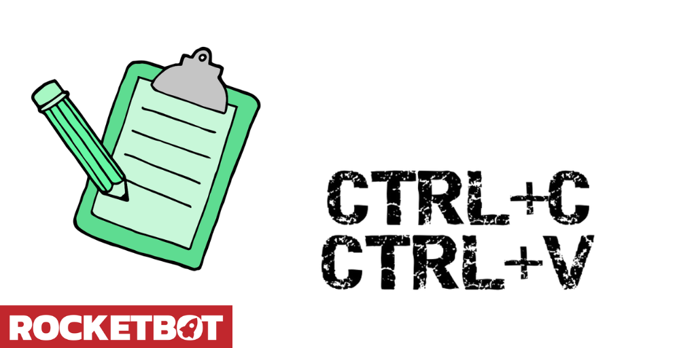

# Clipboard
  
Copiar y pegar del portapapeles  
  

## How to install this module
  
__Download__ and __install__ the content in 'modules' folder in Rocketbot path  

## Description of the commands

### Copy to clipboard
  
Copy variable value to clipboard
|Parameters|Description|example|
| --- | --- | --- |
|Variable||{Variable}|

### Get clipboard data
  
Get data of clipboard
|Parameters|Description|example|
| --- | --- | --- |
|Save in Variable||Variable|

### Add image to clipboard
  
Copy an image to clipboard from path
|Parameters|Description|example|
| --- | --- | --- |
|Image path||credentials.png|

### Save image from clipboard
  
Save an image to path from clipbaord
|Parameters|Description|example|
| --- | --- | --- |
|Image path||credentials.png|
